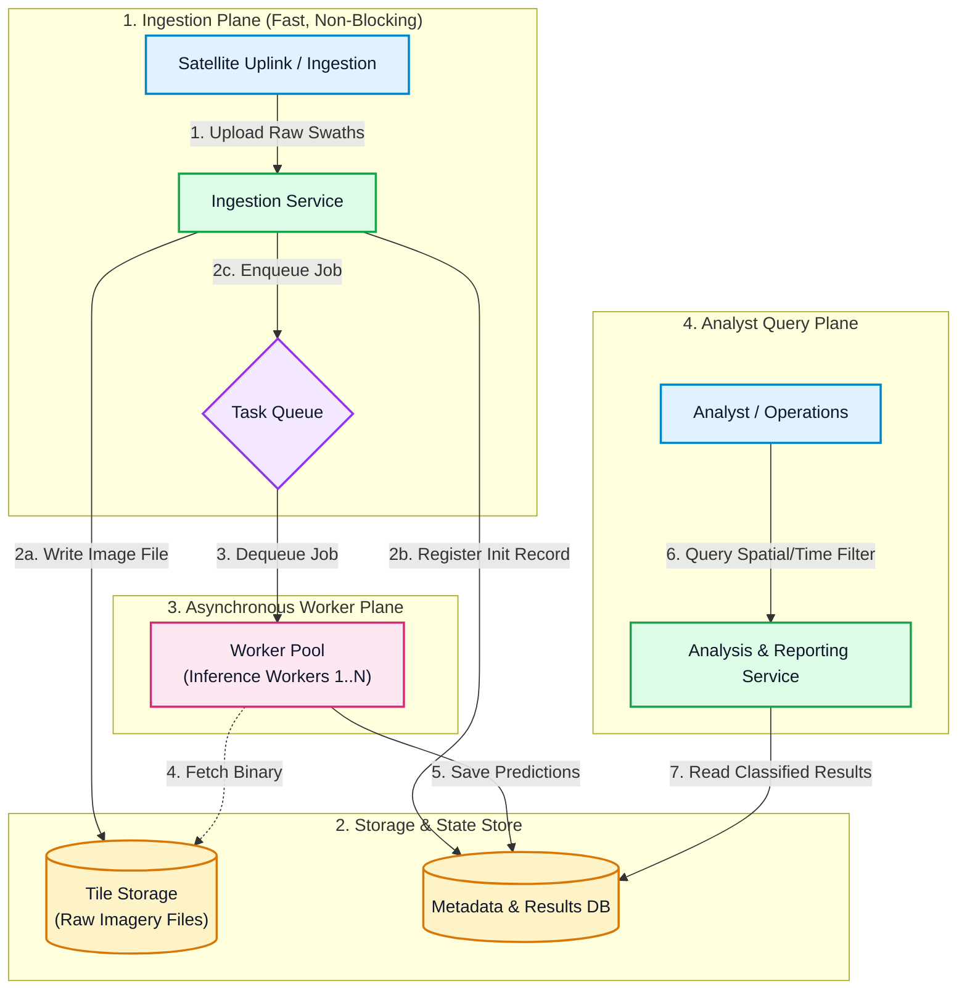
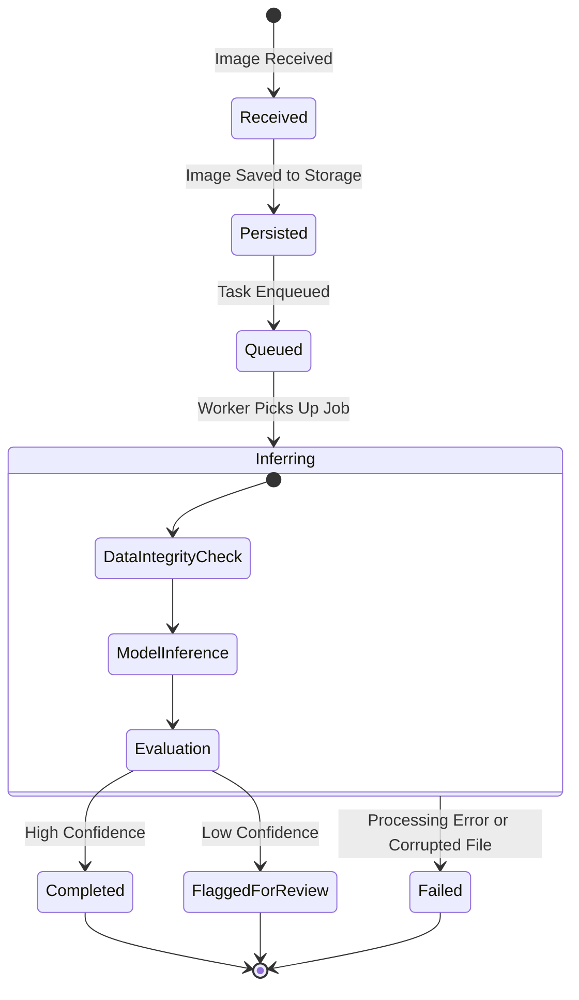
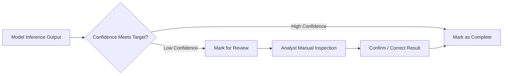

# Architecture & System Design: Asynchronous Tile Ingestion & Classification Pipeline

* **Document Status:** `PROPOSED`
* **Target Audience:** Engineering Leads, System Architects, Geospatial Analysts

---

## 1. Executive Summary

This specification defines the architecture for ingesting satellite imagery tiles, running automated classification, and enabling downstream analysis.

The primary design principle is **strict decoupling of ingestion from inference**:

* **Ingestion** handles bursts of incoming imagery (such as entire downlink swaths) and must stay fast and resilient.
* **Inference** is computationally heavy and runs at a pace governed by available hardware.

Separating these operations via an asynchronous queue prevents upload timeouts, avoids backpressure at the ingestion boundary, and ensures incoming data is preserved even during peak processing loads.

---

## 2. High-Level System Architecture

The system is split into two loosely coupled tiers: an ingestion plane that accepts and stores imagery, and an asynchronous worker pool that processes classifications independently.

### Component Responsibilities

* **Ingestion Layer:** Validates the readability of incoming payloads, writes raw files to disk, writes initial metadata to the database, places a task onto the queue, and returns immediately. It never executes inference.
* **Tile Storage:** Retains raw image content referenced by URI and hash. Keeping raw binaries outside the database prevents transaction log bloat and keeps database backups small and fast.
* **Metadata & Results Store:** Central database tracking operational state, image integrity hashes, spatial boundaries, and model outputs.
* **Task Queue:** Buffers burst traffic. A surge in uploads lengthens the queue rather than causing failed or rejected uploads.
* **Worker Pool:** Pulls jobs from the queue at a sustainable rate, runs verification, executes the model, and updates the database with predictions.
* **Analysis & Reporting Layer:** Dedicated query service enabling analysts to search classified results by class, confidence, geography, or time range without impacting the ingestion pipeline.

---

## 3. Technology & Runtime Strategy

### 3.1 Raw Imagery Storage

* **Strategy:** Store raw images directly on dedicated mounted storage with a content-hashed naming structure.
* **Rationale:** Storing multi-megabyte image binaries directly as database blobs degrades database memory cache efficiency and balloons write-ahead logs. Storing files on disk with references in the database keeps query indexes compact and high-performing.

### 3.2 Model Execution Engine

* **Strategy:** Use an optimized runtime container (such as ONNX Runtime) over full training frameworks or heavy multi-model servers.
* **Rationale:** Full machine learning frameworks introduce unnecessary dependencies, autograd overhead, and large container footprints that complicate deployments (especially in isolated or air-gapped environments). An optimized inference-only runtime provides vectorization on standard CPUs and cleanly separates model training from deployment.

---

## 4. Tile Lifecycle & State Machine

Each tile transitions through a deterministically tracked lifecycle to ensure end-to-end traceability and auditability.

### State Matrix

| State | Transition Trigger | Verification / Action |
| --- | --- | --- |
| `Received` | Payload reaches Ingestion Layer | Validates basic file format and readability. |
| `Persisted` | Written to persistent file storage | Calculates and stores content checksum; registers metadata record. |
| `Queued` | Task ID submitted to Queue | Ingestion operation completes; upstream client acknowledged. |
| `Inferring` | Picked up by available worker | **Re-verifies disk checksum** to catch data corruption since upload; runs model. |
| `Completed` | Classification finished | Model confidence exceeds the class threshold; results saved. |
| `FlaggedForReview` | Classification finished | Model confidence is below threshold; routed to analyst review queue. |
| `Failed` | Processing or integrity error | Records failure reason (e.g., checksum mismatch or damaged file) without halting workers. |

> **Audit Integrity Note:** Re-computing the checksum when the worker picks up the job guarantees that the file processed by the model is byte-for-byte identical to the file originally uploaded, safeguarding downstream audit trails.

---

## 5. Low-Confidence Classification Handling

Silently dropping low-confidence classifications causes missing data, while blindly trusting weak predictions risks false positives in downstream operational decisions.

* **Per-Class Thresholds:** Confidence cutoffs are configurable per class, accounting for the reality that some landscape features have higher visual ambiguity than others.
* **Review Queue Routing:** Below-threshold predictions are flagged rather than dropped. This preserves the machine prediction as a hint while ensuring human oversight on ambiguous targets.

---

## 6. Query Capabilities

The analysis tier provides targeted querying over:

* **Classification Categories:** Filtering by one or more predicted classes.
* **Confidence Intervals:** Selecting tiles within specific confidence bands.
* **Review States:** Triage filtering for pending, completed, or flagged classifications.
* **Temporal Ranges:** Filtering by capture time and ingestion time.
* **Geospatial Boundaries:** Spatial queries (bounding box, polygon intersections) supported by spatial indexing on tile footprints.

---

## 7. Assumptions & Technical Open Questions

* **Spatial Neighboring Context:** Is inference strictly single-tile, or does the model require context from adjacent neighboring tiles (e.g., tracing continuous linear features like roads or waterways)?
* **Imagery Format:** Are inputs standard pre-tiled 3-band chips, or raw multi-spectral data requiring heavy scientific geospatial libraries during pre-processing?
* **Burst Profiles:** What is the anticipated peak volume and arrival frequency of imagery bursts? This dictates queue capacity and worker concurrency requirements.
* **Human-in-the-Loop Feedback:** Will manual analyst corrections in the review queue be exported to form retraining datasets for future model iterations?
* **Resource Envelope:** What are the baseline CPU core counts, memory limits, and disk I/O throughput allocations on the target hosting environment?
